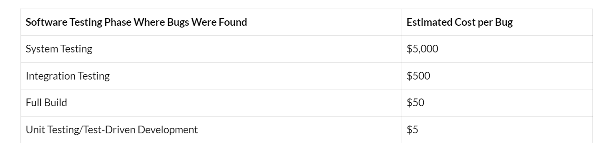

# Unit test

[index](./README.md) / [next](./slide-2.md)

## Cost

Unit tests are the cheapest.

Google: [Cost of finding bugs late](https://www.google.com/search?q=cost+of+finding+bugs+late) 

https://www.coderskitchen.com/cost-of-fixing-vs-preventing-bugs/
Not to mention having a bug on production