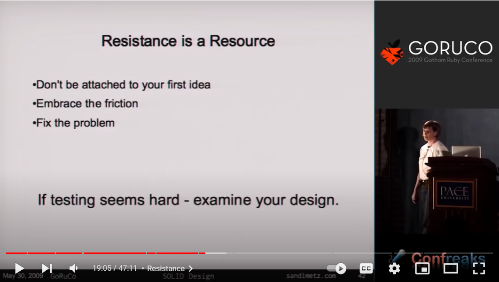

# Unit test

[prev](./slide-1.md) / [next](./slide-3.md)

## Examine design

Youtube: [If testing seems hard - examine your design](https://youtu.be/v-2yFMzxqwU?t=1154). 
Good code is usually easy to test.  If test resists to be written - it asks your code to have a second look.

