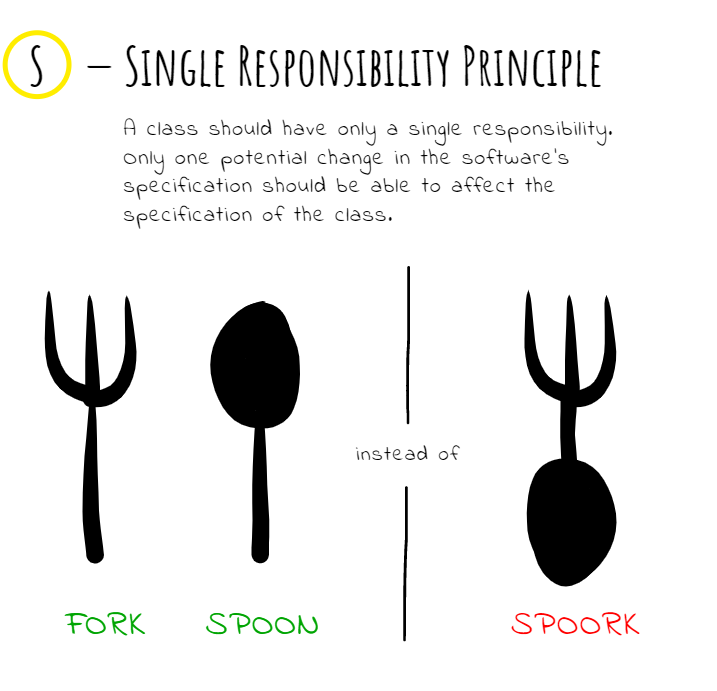

# Design

[prev](./slide-3.md) / [next](./slide-5.md)

## SOLID

In pictures: [solid in sketches](https://okso.app/showcase/solid)

https://itnext.io/solid-principles-sketches-a38865e771f0

### S, Spork

- if one needs spoon he also bears a fork
- tests are twice big, covering a spoon and fork
- probably `soup` and `pasta` mocks would be `lenient()`

