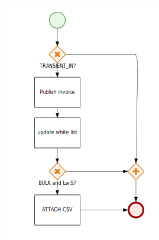
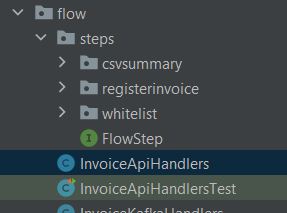

# e-invoicing

[prev](./slide-5.md) / [next](./slide-7.md)


## A step of Flow
 
Google: [bpmn examples](https://www.google.com/search?tbm=isch&as_q=bpmn+examples&tbs=isz:lt,islt:4mp,sur:fmc)

Einvoicing: handlePublishInvoice



### 

### A step of process

`FlowStep` - to be mocked in test

```java
public interface FlowStep<I, O> {

    PayloadObject<String, String, O> execute(PayloadObject<String, String, I> context);
}
```


### A fork of logic

To remain in flow and be tested there

Could be a predicate
```java
Predicate<PayloadObject<....>> isLwis = ....
```


### Structure of code




